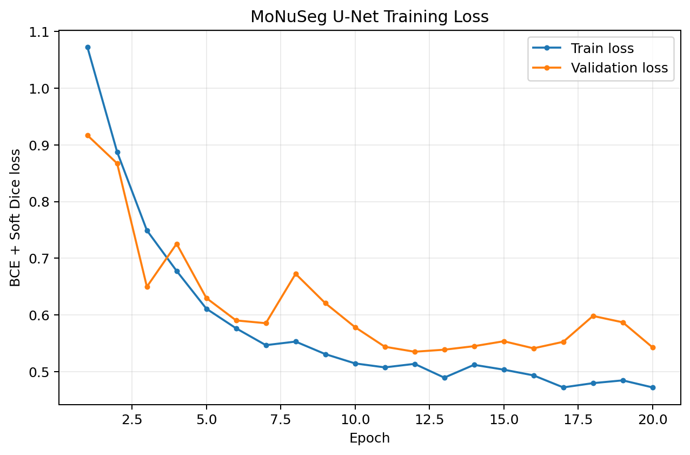
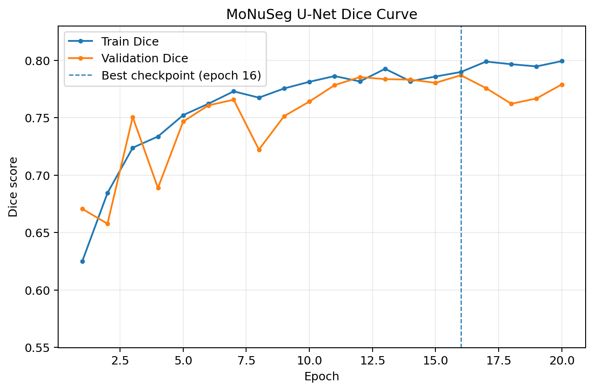
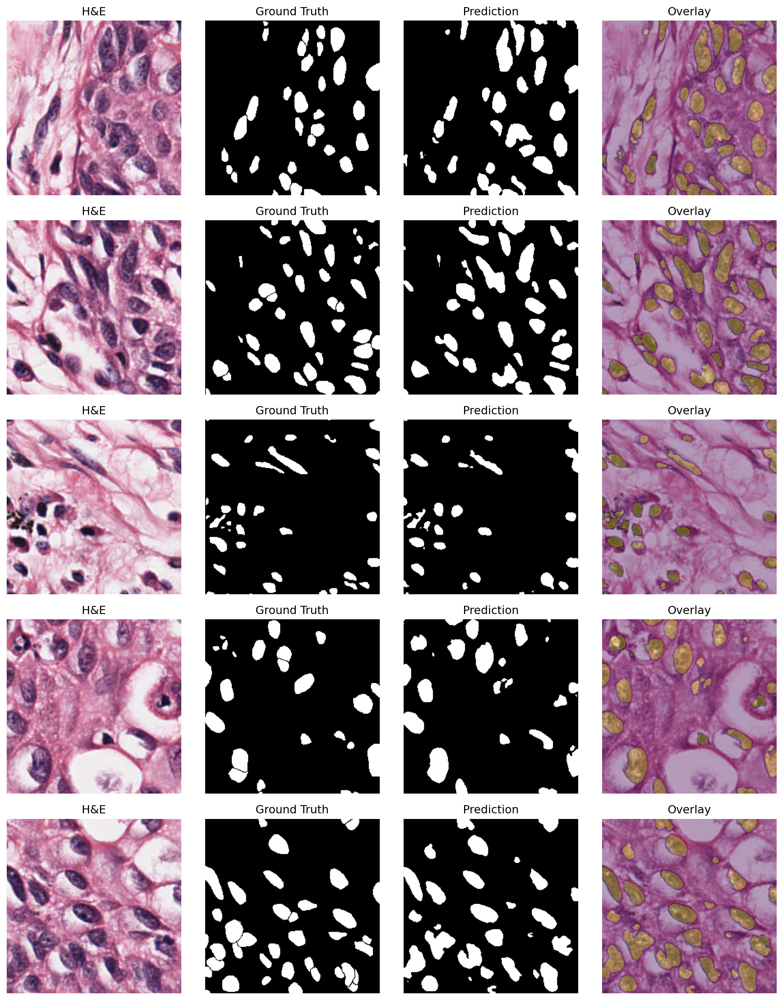

# Histology Nuclei Segmentation with U-Net

An end-to-end semantic segmentation baseline for nuclei in real H&E histology images using **PyTorch U-Net** and the **MoNuSeg 2018** training set.

This project focuses on the practical biomedical imaging workflow: paired H&E image/mask loading, **case-level splitting to avoid patch leakage**, paired augmentation, U-Net training, independent test evaluation, and qualitative overlay inspection.

## Results

| Metric | Result |
|---|---:|
| Source cases | 37 |
| Total 256x256 patches | 333 |
| Train / validation / test cases | 25 / 5 / 7 |
| Train / validation / test patches | 225 / 45 / 63 |
| Best validation Dice | **0.7870** |
| Best checkpoint | Epoch 16 |
| Test mean Dice | **0.8079** |
| Test median Dice | **0.8095** |
| Test Dice SD | **0.0386** |
| Test mean IoU | **0.6795** |

The split is performed at the **source-case level**, not at the patch level, so patches from the same source image never appear in more than one split.

## Training curves





## Test predictions

The test visualization contains four columns: **H&E image | ground truth | prediction | overlay**.



## Pipeline

```text
MoNuSeg H&E images + binary masks
            |
            v
333 paired 256x256 patches
            |
            v
case-level train / val / test split
            |
            v
paired geometric augmentation
            |
            v
RGB U-Net
[B, 3, 256, 256] -> [B, 1, 256, 256]
            |
            v
BCEWithLogitsLoss + Soft Dice loss
            |
            v
best validation checkpoint
            |
            v
independent test Dice / IoU
            |
            v
H&E / GT / prediction / overlay
```

## Data contract

**Image**

```text
RGB TIFF: [H, W, 3], uint8, 0..255
        -> float32 / 255
        -> [3, H, W]
```

**Mask**

```text
grayscale TIFF: [H, W], uint8, {0, 255}
        -> threshold > 0
        -> float32 {0, 1}
        -> [1, H, W]
```

After batching:

```text
images: [B, 3, 256, 256]
masks : [B, 1, 256, 256]
logits: [B, 1, 256, 256]
```

## Model and training

- Architecture: U-Net with three encoder/decoder levels and skip connections
- Input channels: 3 (RGB H&E)
- Output channels: 1 (binary nuclear foreground logit)
- Loss: `BCEWithLogitsLoss + Soft Dice loss`
- Optimizer: AdamW
- Learning rate: `1e-3`
- Batch size: 4
- Epochs: 20
- Model selection: highest validation Dice
- Final evaluation: held-out test cases only

## Repository structure

```text
histology-nuclei-segmentation/
├── data/
│   ├── split_manifest.csv
│   └── raw/                       # ignored by Git
├── outputs/
│   ├── history.json
│   ├── training_summary.json
│   ├── test_metrics.json
│   ├── test_patch_metrics.csv
│   ├── test_case_metrics.csv
│   ├── training_loss_curve.png
│   ├── training_dice_curve.png
│   └── test_predictions.png
├── scripts/
│   ├── make_split.py
│   └── plot_training.py
├── src/
│   ├── __init__.py
│   ├── dataset.py
│   ├── metrics.py
│   └── model.py
├── train.py
├── evaluate.py
├── infer.py
├── requirements.txt
└── README.md
```

## Setup

```bash
conda create -n histoseg python=3.11 -y
conda activate histoseg
pip install -r requirements.txt
```

## Prepare the split

The raw MoNuSeg data are intentionally not committed to GitHub. Place the dataset under:

```text
data/raw/MoNuSeg 2018 Training Data/
```

Then create the leakage-safe manifest:

```bash
python scripts/make_split.py
```

Expected split:

```text
37 source cases / 333 patches
train: 25 cases / 225 patches
val  :  5 cases / 45 patches
test :  7 cases / 63 patches
```

## Train

Smoke test:

```bash
python train.py --epochs 1 --batch-size 4
```

Full run:

```bash
python train.py --epochs 20 --batch-size 4 --lr 1e-3
```

The best checkpoint is selected by validation Dice and written to `outputs/best_model.pt`.

## Evaluate

```bash
python evaluate.py
```

Expected results from the completed reference run:

```text
Test patches: 63
Test cases  : 7
Patch mean Dice: 0.8079
Patch mean IoU : 0.6795
Case mean Dice : 0.8079
Case mean IoU  : 0.6795
```

## Visualize predictions

```bash
python infer.py
```

This creates:

```text
outputs/test_predictions.png
```

## Plot training curves

```bash
python scripts/plot_training.py
```

This creates:

```text
outputs/training_loss_curve.png
outputs/training_dice_curve.png
```

## Important methodological point: avoid patch leakage

A histology source image can produce multiple spatially related patches. Randomly splitting all patches can place patches from the same source image in both training and test sets, inflating apparent performance. This project therefore performs the split at the **source-case level first**, then assigns its patches to the corresponding split.

## Scope

This is **binary semantic nuclear foreground segmentation**, not instance segmentation. All nuclear pixels are treated as one foreground class. Separating touching nuclei into individual instances would require additional instance-aware modeling or post-processing (for example watershed, HoVer-Net, or CellViT-style approaches).

## Key takeaway

> I implemented an end-to-end U-Net pipeline for real H&E nuclear segmentation, using case-level splitting to prevent patch leakage, paired augmentation, BCE plus soft Dice loss, and independent held-out testing. The model achieved a mean test Dice of 0.808 and mean IoU of 0.679 across seven unseen source cases.
